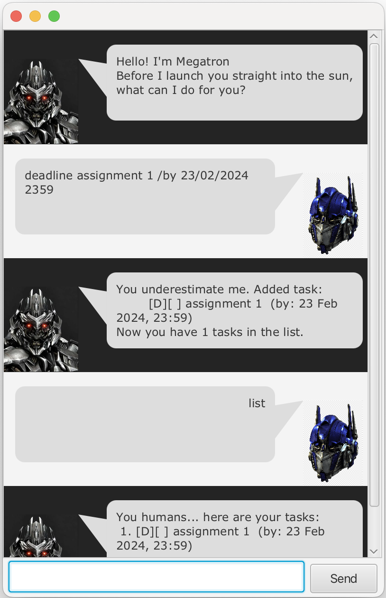

# Megatron User Guide
#### Your fierce chat-bot



Megatron is a desktop app for **managing a list of things to do** through a Graphical User Interface (GUI).

## Add todo: `todo`
**Task code: "T"** \
Adds an activity to the list of things to do. 

Format: `todo TASK_DESCRIPTION` \
Example: `todo laundry`
```
You underestimate me. Added task:
    [T][ ] laundry
Now you have 1 tasks in the list
```

## Add deadlines: `deadline`
**Task code: "D"** \
Adds an activity with a stipulated deadline to the task list.

Format: `deadline TASK_DESCRIPTION /by DD/MM/YYYY hhmm` \
Example: `deadline assignment 1 /by 21/02/2024 2359`

```
You underestimate me. Added task:
    [D][ ] Assignment 1 (by: 21 Feb 2024, 23:59)
Now you have 1 tasks in the list
```

## Add events: `event`
**Task code: "E"** \
Adds an activity with a stipulated start and end date-time to the task list.

Format: `event TASK_DESCRIPTION /from DD/MM/YYYY hhmm /to DD/MM/YYYY hhmm` \
Example: `event Open House /from 09/03/2024 1000 /to 09/03/2024 1630`

```
You underestimate me. Added task:
    [E][ ] Open House (from: 09 Mar 2024, 10:00 to: 09 Mar 2024, 16:30)
Now you have 1 tasks in the list
```

## Delete tasks: `delete`
Deletes tasks based on given index

Format: `delete TASK_INDEX` \
Example: `delete 1`

```
I am LEADER OF THE DECEPTICONS. I will remove this task for you:
    [T][ ] homework
Now you have 0 tasks in the list.
```

## List tasks: `list`
Lists all tasks present

Format: `list` \
Example: `list`

```
You humans... here are your tasks:
    1. [T][ ] laundry
```

## Mark task: `mark`
Marks task at given index as *complete*

Format: `mark TASK_INDEX` \
Example: `mark 1`

```
Wow! I've marked this task as done:
    [T][X] laundry
```

## Unmark task: `unmark`
Mark task at given index as *incomplete*

Format: `unmark TASK_INDEX` \
Example: `unmark 1`

```
Foolish humans, I've marked this task as incomplete:
    [T][ ] laundry
```

## Find tasks: `find`
Finds tasks matching the given search query

Format: `find SEARCH_QUERY` \
Example: `find clean`

```
Quick, here's what I found:
    1. [T][ ] clean my room
```

## Undo command: `undo`
Undo last command \
Commands undo-ed cannot be undo-ed again \
List of commands that can be undo-ed: `delete` `add` `mark` `unmark`


Format: `undo` \
Example: `undo` \
\
eg. undo-ing delete
```
You are lucky I kept it!
    [T][X] laundry
has been added back.
```

## Exit command: `bye`
Exits programme

Format: `bye` \
Example: `bye` \

```
Bye, I'm off to find the spark!
```

